# 🏗️ TecnoAndamios - Arquitectura de Base de Datos

## Diagrama Entidad-Relación

```mermaid
erDiagram
    %% ============================================
    %% GESTIÓN DE USUARIOS Y SEGURIDAD
    %% ============================================
    
    usuarios {
        int id PK
        string email UK
        string nombre
        string google_id UK
        boolean activo
        datetime created_at
        datetime updated_at
    }
    
    roles {
        int id PK
        string nombre UK "Admin, Operador, Supervisor"
        string descripcion
        json permisos "JSON con permisos específicos"
    }
    
    usuario_roles {
        int id PK
        int usuario_id FK
        int rol_id FK
        datetime asignado_en
    }
    
    %% ============================================
    %% MAESTRO DE CLIENTES Y CONTACTOS
    %% ============================================
    
    clientes {
        int id PK
        string empresa UK
        string rut UK
        string direccion
        string rubro "Construcción, Inmobiliario"
        string correo_empresa
        int usuario_responsable_id FK
        boolean activo
        datetime created_at
        datetime updated_at
    }
    
    contactos {
        int id PK
        int cliente_id FK
        string nombre
        string telefono
        string correo
        string tipo "Obra, Empresa, Facturación"
        boolean principal
        datetime created_at
    }
    
    %% ============================================
    %% MAESTRO DE OBRAS
    %% ============================================
    
    obras {
        int id PK
        int cliente_id FK
        string nombre UK
        string direccion
        string region
        int responsable_id FK
        boolean activa
        datetime created_at
        datetime updated_at
    }
    
    %% ============================================
    %% CATÁLOGO DE EQUIPOS
    %% ============================================
    
    categorias_equipos {
        int id PK
        string nombre UK "Andamio Colgante, Cremallera, Montacarga"
        string descripcion
        boolean activo
    }
    
    equipos {
        int id PK
        int categoria_id FK
        string nombre
        string codigo UK
        string descripcion
        json especificaciones "JSON con campos técnicos"
        boolean disponible
        datetime created_at
    }
    
    componentes_equipo {
        int id PK
        int equipo_id FK
        string nombre "Motor, Panel, Baranda, Piso, etc"
        string unidad "unidad, metros, kg"
        decimal precio_unitario_uf
        boolean obligatorio
    }
    
    %% ============================================
    %% INVENTARIO (NUEVO)
    %% ============================================
    
    inventario_equipos {
        int id PK
        int equipo_id FK
        string numero_serie UK
        string estado "Disponible, Alquilado, Mantenimiento, Baja"
        string ubicacion
        datetime fecha_ultima_revision
        text observaciones
        datetime created_at
        datetime updated_at
    }
    
    %% ============================================
    %% ESTADOS DE PAGO (EDP) - DOCUMENTO MAESTRO
    %% ============================================
    
    edp {
        int id PK
        string codigo UK "EDP_1, EDP_2..."
        int cliente_id FK
        int obra_id FK
        string orden_compra
        date fecha_inicio
        date fecha_corte
        date fecha_termino
        string unidad_alquiler "Valor UF, Pesos"
        int usuario_id FK "Responsable"
        decimal importe_total
        string estado "Borrador, Abierto, Cerrado, Validado, Facturado, Cobrado"
        string url_orden_compra "Drive/Storage"
        datetime created_at
        datetime updated_at
    }
    
    edp_equipos {
        int id PK
        int edp_id FK
        int equipo_id FK
        int cantidad
        json configuracion "JSON con componentes específicos"
        text comentarios
        decimal subtotal_uf
    }
    
    edp_servicios {
        int id PK
        int edp_equipo_id FK
        int tipo_servicio_id FK
        int cantidad
        decimal precio_unitario_uf
        decimal subtotal_uf
    }
    
    tipos_servicio {
        int id PK
        string nombre UK "Armado, Desarmado, Flete, Mantención, Visita Técnica"
        string descripcion
        boolean activo
    }
    
    %% ============================================
    %% CICLO DE VIDA DEL EDP
    %% ============================================
    
    edp_estados_historico {
        int id PK
        int edp_id FK
        string estado_anterior
        string estado_nuevo
        date fecha
        int usuario_id FK
        text comentario
        datetime created_at
    }
    
    edp_cargos_adicionales {
        int id PK
        int edp_id FK
        string concepto
        decimal importe
        date fecha_aplicacion
        int usuario_responsable_id FK
        datetime created_at
    }
    
    edp_valores_uf {
        int id PK
        int edp_id FK
        date mes_aplicacion
        decimal valor_uf
        int usuario_id FK
        datetime created_at
    }
    
    %% ============================================
    %% GESTIÓN DE CONTENEDORES
    %% ============================================
    
    contenedores {
        int id PK
        string codigo UK
        int cliente_id FK
        int obra_id FK
        decimal dimension
        string botadero
        int cantidad
        date fecha_inicio
        decimal costo_servicio
        string zona
        string estado "Entregado, En Obra, Retirado"
        int responsable_id FK
        datetime created_at
        datetime updated_at
    }
    
    contenedor_movimientos {
        int id PK
        int contenedor_id FK
        string tipo_accion "Entrega, Retiro, Cambio"
        date fecha
        string guia_despacho
        string numero_vale
        decimal peso_neto_toneladas
        decimal valor_kdm
        time hora
        string patente_camion
        string chofer
        string botadero
        string url_guia
        string url_vale
        string url_comprobante
        text comentarios
        datetime created_at
    }
    
    %% ============================================
    %% GESTIÓN FINANCIERA
    %% ============================================
    
    caja_chica {
        int id PK
        string codigo UK "Auto-generado"
        string tipo_movimiento "Ingreso, Egreso, Comprobante"
        int categoria_gasto_id FK "Solo para Egresos"
        decimal importe
        string origen_destino "TDC, Caja Chica Sur, Santiago"
        int responsable_id FK
        date fecha_movimiento
        string motivo_ingreso "Solo para Ingresos"
        int edp_id FK "Opcional"
        int vehiculo_id FK "Opcional para combustible/mantención"
        string tipo_comprobante "Boleta, Factura, No aplica"
        string numero_comprobante
        decimal litros_cargados "Solo combustible"
        string url_comprobante
        text comentario
        datetime created_at
    }
    
    categorias_gasto {
        int id PK
        string nombre UK
        string descripcion
        boolean requiere_vehiculo
        boolean activo
    }
    
    vehiculos {
        int id PK
        string matricula UK
        string marca
        string modelo
        int anio
        string tipo "Camión, Camioneta, Auto"
        string estado "Activo, Mantenimiento, Baja"
        datetime created_at
        datetime updated_at
    }
    
    gastos_generales {
        int id PK
        int cliente_id FK "Opcional"
        date fecha_egreso
        string concepto
        string sub_concepto
        decimal importe
        int responsable_id FK
        text comentario
        datetime created_at
    }
    
    %% ============================================
    %% RELACIONES
    %% ============================================
    
    usuarios ||--o{ usuario_roles : "tiene"
    roles ||--o{ usuario_roles : "asignado_a"
    
    usuarios ||--o{ clientes : "responsable_de"
    clientes ||--o{ contactos : "tiene"
    clientes ||--o{ obras : "tiene"
    usuarios ||--o{ obras : "responsable_de"
    
    categorias_equipos ||--o{ equipos : "pertenece_a"
    equipos ||--o{ componentes_equipo : "tiene"
    equipos ||--o{ inventario_equipos : "instancia_de"
    
    clientes ||--o{ edp : "solicita"
    obras ||--o{ edp : "asociado_a"
    usuarios ||--o{ edp : "gestiona"
    
    edp ||--o{ edp_equipos : "incluye"
    equipos ||--o{ edp_equipos : "alquilado_en"
    edp_equipos ||--o{ edp_servicios : "requiere"
    tipos_servicio ||--o{ edp_servicios : "tipo"
    
    edp ||--o{ edp_estados_historico : "historial"
    usuarios ||--o{ edp_estados_historico : "registrado_por"
    
    edp ||--o{ edp_cargos_adicionales : "tiene"
    usuarios ||--o{ edp_cargos_adicionales : "registrado_por"
    
    edp ||--o{ edp_valores_uf : "usa"
    usuarios ||--o{ edp_valores_uf : "registrado_por"
    
    clientes ||--o{ contenedores : "alquila"
    obras ||--o{ contenedores : "ubicado_en"
    usuarios ||--o{ contenedores : "responsable"
    contenedores ||--o{ contenedor_movimientos : "tiene"
    
    categorias_gasto ||--o{ caja_chica : "clasifica"
    usuarios ||--o{ caja_chica : "responsable"
    edp ||--o{ caja_chica : "relacionado"
    vehiculos ||--o{ caja_chica : "asociado"
    
    clientes ||--o{ gastos_generales : "asociado"
    usuarios ||--o{ gastos_generales : "registrado_por"
```



## 📋 Descripción de Módulos

### 1. **Gestión de Usuarios y Seguridad**
- Login con Google OAuth
- Sistema de roles y permisos granulares
- Auditoría de acciones

### 2. **Maestro de Clientes**
- Información de empresas
- Múltiples contactos por cliente
- Responsable asignado

### 3. **Maestro de Obras**
- Obras asociadas a clientes
- Control de estado (activa/inactiva)
- Responsable por obra

### 4. **Catálogo de Equipos**
- Categorías parametrizables
- Componentes específicos por equipo
- Precios en UF

### 5. **Inventario (NUEVO)**
- Control de cada unidad física
- Estados: Disponible, Alquilado, Mantenimiento
- Trazabilidad

### 6. **Estados de Pago (EDP)**
- Documento maestro del alquiler
- Configuración dinámica de equipos
- Servicios asociados
- Ciclo de vida completo

### 7. **Contenedores**
- Gestión independiente
- Movimientos (entrega, retiro, cambio)
- Documentación adjunta

### 8. **Gestión Financiera**
- Caja chica con categorías parametrizables
- Relación con vehículos
- Comprobantes digitalizados
- Gastos generales

## 🔑 Mejoras Clave vs Sistema Actual

### ❌ Problema Actual → ✅ Solución

1. **102 columnas en EDP** 
   → Normalizado en: `edp`, `edp_equipos`, `edp_servicios`, `componentes_equipo`

2. **Sin inventario físico**
   → Nueva tabla: `inventario_equipos`

3. **Categorías hardcodeadas**
   → Tablas paramétricas: `categorias_gasto`, `tipos_servicio`, `categorias_equipos`

4. **Sin control de estados**
   → `edp_estados_historico` con auditoría completa

5. **Vehículos hardcodeados**
   → Tabla `vehiculos` con ABM completo

6. **Archivos dispersos en Drive**
   → Campos `url_*` centralizados en el storage de la aplicación

7. **Sin validaciones**
   → Constraints, FKs, y lógica de negocio en el backend

## 🎯 Índices Recomendados

```sql
-- Clientes
CREATE INDEX idx_clientes_rut ON clientes(rut);
CREATE INDEX idx_clientes_usuario_responsable ON clientes(usuario_responsable_id);

-- EDP
CREATE INDEX idx_edp_codigo ON edp(codigo);
CREATE INDEX idx_edp_cliente ON edp(cliente_id);
CREATE INDEX idx_edp_obra ON edp(obra_id);
CREATE INDEX idx_edp_estado ON edp(estado);
CREATE INDEX idx_edp_fecha_inicio ON edp(fecha_inicio);

-- Caja Chica
CREATE INDEX idx_caja_fecha ON caja_chica(fecha_movimiento);
CREATE INDEX idx_caja_tipo ON caja_chica(tipo_movimiento);
CREATE INDEX idx_caja_categoria ON caja_chica(categoria_gasto_id);

-- Contenedores
CREATE INDEX idx_contenedores_cliente ON contenedores(cliente_id);
CREATE INDEX idx_contenedores_obra ON contenedores(obra_id);
CREATE INDEX idx_contenedores_estado ON contenedores(estado);

-- Inventario
CREATE INDEX idx_inventario_equipo ON inventario_equipos(equipo_id);
CREATE INDEX idx_inventario_estado ON inventario_equipos(estado);
CREATE INDEX idx_inventario_serie ON inventario_equipos(numero_serie);
```

## 📊 Vistas Útiles

```sql
-- Vista de EDP con totales
CREATE VIEW v_edp_completo AS
SELECT 
    e.id,
    e.codigo,
    c.empresa AS cliente,
    o.nombre AS obra,
    e.fecha_inicio,
    e.estado,
    COUNT(DISTINCT ee.id) AS cantidad_equipos,
    SUM(ee.subtotal_uf) AS subtotal_equipos_uf,
    SUM(es.subtotal_uf) AS subtotal_servicios_uf,
    e.importe_total
FROM edp e
LEFT JOIN clientes c ON e.cliente_id = c.id
LEFT JOIN obras o ON e.obra_id = o.id
LEFT JOIN edp_equipos ee ON e.id = ee.edp_id
LEFT JOIN edp_servicios es ON ee.id = es.edp_equipo_id
GROUP BY e.id;

-- Vista de Caja Chica con detalles
CREATE VIEW v_caja_chica_detalle AS
SELECT 
    cc.id,
    cc.codigo,
    cc.fecha_movimiento,
    cc.tipo_movimiento,
    cg.nombre AS categoria,
    cc.importe,
    u.nombre AS responsable,
    e.codigo AS edp_relacionado,
    v.matricula
FROM caja_chica cc
LEFT JOIN categorias_gasto cg ON cc.categoria_gasto_id = cg.id
LEFT JOIN usuarios u ON cc.responsable_id = u.id
LEFT JOIN edp e ON cc.edp_id = e.id
LEFT JOIN vehiculos v ON cc.vehiculo_id = v.id;

-- Vista de disponibilidad de equipos
CREATE VIEW v_equipos_disponibilidad AS
SELECT 
    e.id,
    e.nombre,
    e.codigo,
    ce.nombre AS categoria,
    COUNT(ie.id) AS total_unidades,
    SUM(CASE WHEN ie.estado = 'Disponible' THEN 1 ELSE 0 END) AS disponibles,
    SUM(CASE WHEN ie.estado = 'Alquilado' THEN 1 ELSE 0 END) AS alquilados,
    SUM(CASE WHEN ie.estado = 'Mantenimiento' THEN 1 ELSE 0 END) AS en_mantenimiento
FROM equipos e
LEFT JOIN categorias_equipos ce ON e.categoria_id = ce.id
LEFT JOIN inventario_equipos ie ON e.id = ie.equipo_id
GROUP BY e.id;
```

## 🚀 Próximos Pasos

1. ✅ **Definir estructura de datos** (HECHO)
2. ⏭️ **Crear scripts de migración**
3. ⏭️ **Definir modelos Sequelize**
4. ⏭️ **Diseñar APIs REST**
5. ⏭️ **Arquitectura Angular (módulos, componentes)**
6. ⏭️ **Plan de migración de datos actuales**

¿Querés que avancemos con alguno de estos puntos?
